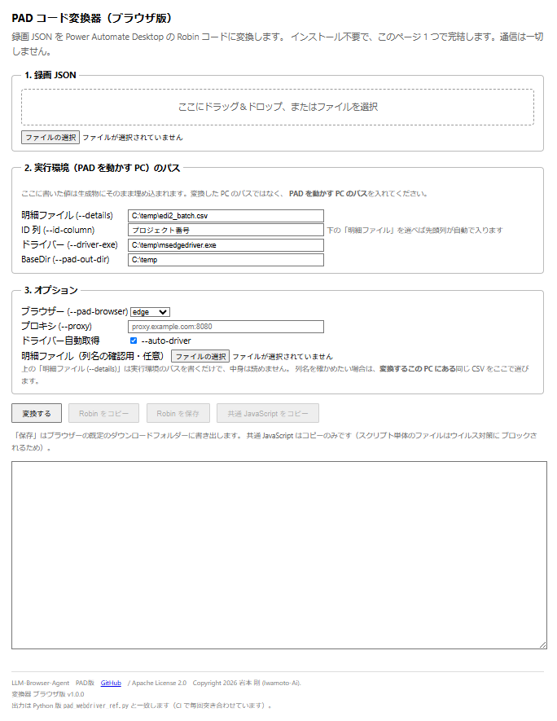
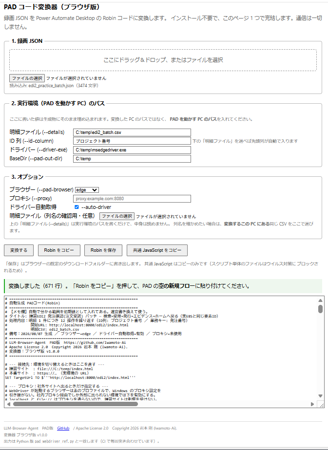

# Power Automate Desktop 無料版 (PAD) と WebDriver だけでバッチ実行する（ブラウザ拡張機能は不要）

Power Automate Desktop 無料版（PAD）の Web 自動化アクションは専用のブラウザ拡張機能を必要とするが、
**WebDriver はブラウザ拡張機能が無くても動作する。** `msedgedriver.exe` 自体がローカルの HTTP サーバーとして動く。
つまり **HTTP リクエストを送れれば、拡張機能なしでブラウザを完全に操作できる**。
PAD の「Web サービスの呼び出し」がまさにそれに当たる。

このドキュメントは、`run_batch.py`（Python 版バッチランナー）と同じことを、
**Python を使わず PAD だけで**実現するため Python 版のコア部分のDOMベース要素インデックスモジュールを JavaScript で作り直したプログラムを埋め込むことで実現した。

企業環境では次のような制約が同時に成立することがある。この手法はそこを通り抜けるためのもの。

- ブラウザー拡張機能のインストールが禁止されている。
- Python / Node.js などの開発ツールがインストールできない。
- PowerShell スクリプトの実行が禁止されている。
- Proxy Server を使用している環境。
- 一方で Power Automate Desktop 無料版 (PAD) と WebDriver は使える。


**実機（Power Automate Desktop 無料版 (PAD) / Windows 11 / Edge）で完走を確認済み。** 以下の記述は原則として実機で
確認できた内容を明記している。


---

## 💡Power Automate Desktop 無料版 (PAD) 標準の録画機能との違い

本ツール
- ブラウザ自動化ツールなので、ブラウザ自動化バッチ処理に特化し、バッチ運用フロー設定を自動追加し、はまり回避対策をしたPADコード(Robin)に変換する設計。
- DevTools Recorder機能があるブラウザさえあれば操作録画できる。
- 全体のフロー制御はPADを使うが、主なブラウザのコントロールやDOMベース要素インデックス方式はJavaScriptで作ったプログラムをRobinに埋め込み実現。
- 直接WebDriverを操作するのでブラウザ拡張機能なしで使える。

Power Automate Desktop 無料版 (PAD)
- PAD標準の操作録画機能は全般的な用途に使えるように操作をアクションとしてそのまま登録するだけになっている。


---

## 🧭 全体像

```
┌──────────────────────────┐
│ Power Automate Desktop   │
│  Web.InvokeWebService    │  ← 標準アクション。ブラウザ拡張機能は不要。
└────────────┬─────────────┘
             │ HTTP + JSON (W3C WebDriver)
             │ http://127.0.0.1:9515
┌────────────▼─────────────────────────────┐
│ msedgedriver.exe または chromedriver.exe  │  ← System.RunApplication で起動。
└────────────┬─────────────────────────────┘
             │ DevTools Protocol
┌────────────▼────────────────────────┐
│ Microsoft Edge または Google Chrome  │
└─────────────────────────────────────┘
```

| 役割 | 担当 |
| --- | --- |
| 明細（Excel/CSV）の読み込み、件数ループ、skip 判定、進捗、結果 CSV、リトライ | **PAD の標準アクション** |
| ブラウザの起動・画面遷移・クリック・入力・スクショ | **WebDriver**（PAD から HTTP で指示） |

Python 版との対応:

| Python 版 (`run_batch.py`) | PAD 版 |
| --- | --- |
| `--details` の CSV/xlsx 読み込み | 「CSV ファイルから読み取る」 |
| 明細ごとのループ | 「For each」 |
| `skip` 列 | 「If」 |
| `--max-items` | カウンタ変数 + 「If」 |
| `setup` / `loop` / `recover` | 同じ 3 部構成（サブフローに分けてもよい） |
| 失敗しても次の件へ | `FailOnErrorStatus: False` + `ok` 判定 + `NEXT LOOP` |
| `--retry-from` | 結果 CSV を明細として読み直す（`RetryMode`） |
| 進捗表示 | 「テキストをファイルに書き込む」 |
| 結果 CSV | 「テキストをファイルに書き込む」（追記） |
| エビデンスのスクショ | WebDriver の `/screenshot` + 「Base64 をファイルに変換する」 |

> 初版では「失敗しても次の件へ」を PAD の［エラー発生時（On block error）］で実現する想定だった。
> しかし `FailOnErrorStatus: False` を指定すると HTTP エラーでフローが止まらないため、
> **［エラー発生時］は不要**であることが実機で判明した。現在は `ok` 判定と `NEXT LOOP` で
> 制御している。

---

## 🛠️ 事前準備

1. **💡本ツールは自動でブラウザのバージョンをチェックして、同じバージョンの WebDriver を自動取得し入れ替える機能がある。（後述）**　　

　　もし、WebDriverを自動取得できない環境の場合は手動でダウンロードする。 <br>
　　[Microsoft Edge を自動操作する場合の WebDriver](https://developer.microsoft.com/ja-jp/microsoft-edge/tools/webdriver?form=MA13LH&cs=3787589721) から **msedgedriver.exe** をダウンロードする。　<br>
　　[Google Chrome を自動操作する場合の webDriver](https://developer.chrome.com/docs/chromedriver?hl=ja) から **chromedriver.exe** をダウンロードする。 <br>

 　　**⚠️ブラウザのバージョンとWebDriverのバージョンは一致させる必要がある。** <br>
 　　ブラウザのバージョンが更新されたら同じバージョンに入れ替える。　<br>

　　msedgedriver.exe と chromedriver.exe は技術的にはどちらもChromiumエンジンを基にしているため、 <br>
　　コードの書き方やAPI（操作コマンド）、DevTools は、ほぼ共通で違いはごくわずかで、ほぼ対象ブラウザが Edge か Chrome かの違い。<br>

2. **プロキシ除外**: 社内プロキシがあると `localhost` 宛が失敗する。Windows のプロキシ設定で
   `localhost;127.0.0.1` を除外に入れる（Ollama で `NO_PROXY=localhost` を設定したのと同じ対策）。

3. **フローの先頭で古いドライバーを終了させる。** 前回の実行が異常終了すると
   `msedgedriver.exe` がポート 9515 を掴んだまま残り、新しいドライバーが起動できない。 <br>
   その状態では**古い方が応答してしまい**、ブラウザーとバージョンが違えば `session not created` になる。 <br>
   Edge と Chrome のフローを続けて動かす場合も同じポートを奪い合うため、両方を終了させておく。

```
System.TerminateProcess.TerminateProcessByName ProcessName: $'''msedgedriver'''
System.TerminateProcess.TerminateProcessByName ProcessName: $'''chromedriver'''
WAIT 1
System.RunApplication.RunApplication ApplicationPath: DriverExe CommandLineArguments: $'''--port=9515''' WindowStyle: System.ProcessWindowStyle.Hidden ProcessId=> DriverPid
WAIT 3
```

`taskkill` を「アプリケーションの実行」で呼ぶ必要はない。`System.TerminateProcess` で足りる。


---

## 🔄 自動 WebDriver 取得更新機能　(`selenium-manager-windows.exe` 必要)

**Edge と Chromeブラウザ は自動更新される。** そのたびに `msedgedriver.exe` を同じバージョンに入れ替えないと
`session not created` で止まる。　これを手作業で追いかけるのは現実的でない。

自動にするため **Selenium Manager**（Selenium 公式の単体実行ファイルで、Python も Node.js も要らない）
を使用し、インストール済みブラウザーに対応するバージョンのWebDriverを自動で取得し更新する。

-⚠️`selenium-manager-windows.exe` をダウンロードし実行環境の `BaseDir`（例 `C:\temp`）に置いておく必要がある。 <br>
　　入手先: <https://github.com/SeleniumHQ/selenium_manager_artifacts/releases>

```
selenium-manager-windows.exe --browser edge --browser-version stable --output json
```

```json
{
  "logs": [ … ],
  "result": {
    "code": 0,
    "message": "",
    "driver_path": "C:\\Users\\…\\.cache\\selenium\\msedgedriver\\win64\\150.0.4078.105\\msedgedriver.exe",
    "browser_path": "C:\\Program Files (x86)\\Microsoft\\Edge\\Application\\msedge.exe"
  }
}
```

⚠️**置き場所がバージョン番号を含むフォルダになる**点に注意。固定パスを `DriverExe` に書くと
更新のたびに壊れるので、この  `result.driver_path` をフローが読み取って使う。

**Chrome でも同じ仕組みが使える。** 生成物の冒頭にある `Browser` を `chrome` に変えるだけで、
WebDriver へ渡すブラウザー名（`MicrosoftEdge` → `chrome`）、終了させるプロセス名
（`msedgedriver` → `chromedriver`）、Selenium Manager が取得するドライバーの 3 つが同時に切り替わる。

```
SET Browser TO $'''edge'''
SET BrowserName TO $'''MicrosoftEdge'''
SET DriverProc TO $'''msedgedriver'''
IF Browser = $'''chrome''' THEN
    SET BrowserName TO $'''chrome'''
    SET DriverProc TO $'''chromedriver'''
END
```

💡対象サイトがブラウザー判定で表示を変える場合や、片方で不具合が出たときの逃げ道としても使える。
生成時に決めておくなら `--pad-browser chrome` を付ける。

生成器に `--auto-driver` を付けると次の仕組みが入る。**スイッチは冒頭の設定にまとめてあり、
実際に取得を走らせる処理だけがドライバー起動の直前に置かれる。**

```
# --- ドライバーの入手方法 ---（冒頭の設定）
SET AutoDriver TO True
SET SmExe TO $'''selenium-manager-windows.exe'''
```


```
SET AutoDriver TO True
SET SmExe TO $'''selenium-manager-windows.exe'''
IF AutoDriver THEN
    SET SmArgs TO $'''%SmExe% --browser %Browser% --browser-version stable --output json'''
    IF UseProxy THEN
        SET SmArgs TO $'''%SmArgs% --proxy %ProxyAddr%'''
    END
    Scripting.RunDOSCommand.RunDOSCommandAndFailOnTimeout DOSCommandOrApplication: SmArgs WorkingDirectory: BaseDir Timeout: 300 StandardOutput=> SmOutput StandardError=> SmError ExitCode=> SmExit
    Variables.ConvertJsonToCustomObject Json: SmOutput CustomObject=> SmObj
    IF SmObj['result']['code'] = 0 THEN
        SET DriverExe TO SmObj['result']['driver_path']
    END
END
```

- **標準出力を受け取るのは「DOS コマンドの実行」**（`Scripting.RunDOSCommand`）。これまで使ってきた
  「アプリケーションの実行」では出力を受け取れない。
- **社内プロキシ環境ではドライバーのダウンロードもプロキシ経由**になるため、`--proxy` が要る。
  `UseProxy` が `True` のときだけ自動で付く。
- 初回はダウンロードが走るので `Timeout` は長め（300 秒）にしておく。2 回目以降はキャッシュから返る。
- `ELSE` を使わず `IF code = 0` と `IF code <> 0` の 2 つに分けている（未検証の構文を避けるため）。
- 取得に失敗したときは `Halt` を立てて**ドライバー起動そのものに入らない**。ここで止めないと、
  更新前の古い固定パスで起動してしまい、症状が「セッション作成の失敗」に化けて原因が読めなくなる。

### ドライバーとブラウザーの照合を目に見える形にする

`AutoDriver` は「合っているはず」を前提にしていて、実際に何が起動したのかは出てこなかった。
セッションを張った直後に、応答の `capabilities` から**実際に動いているもの**を取り出して
ログとダイアログに出す。

```
SET BrowserVer TO SessionObj['value']['capabilities']['browserVersion']
SET DriverVer TO $'''(不明)'''
IF Browser = $'''chrome''' THEN
    SET DriverVer TO SessionObj['value']['capabilities']['chrome']['chromedriverVersion']
END
IF Browser = $'''edge''' THEN
    SET DriverVer TO SessionObj['value']['capabilities']['msedge']['msedgedriverVersion']
END
```

出力はこの 1 行。`ShowDriverInfo` を `False` にするとダイアログは出ないが、ログには必ず残る。

```
[ドライバー] ブラウザー=chrome 151.0.7922.72 / WebDriver=chromedriver 151.0.7922.72 (…) /
メジャー判定=一致 / 取得方法=Selenium Manager（ブラウザーのバージョンに合わせて自動取得）/ パス=…
```

- **比較するのはメジャーバージョンだけ。** Chrome とドライバーはビルド番号まで一致するとは
  限らない（ブラウザー 115.0.5790.110 に対しドライバー 115.0.5790.102 など）。完全一致で
  判定すると、正常な組み合わせを不一致と報告してしまう。
- **メジャーの取り出しはページ側の JavaScript にやらせている。** PAD のテキスト分割アクションを
  増やさずに済み、貼り付け時に黙って落ちる行を作らない。`/session/…/execute/sync` は
  すでに使っている呼び出しなので、新しい仕組みは何も増えない。
- `取得方法` は `AutoDriver` の結果で切り替わる。自動取得なら「ブラウザーのバージョンに
  合わせて自動取得」、`False` なら「固定パス（ブラウザー更新時は手動で入れ替え）」と出る。
  **ブラウザーだけ更新されて止まったときに、どちらの経路で動いていたかが後から分かる。**

### 起動したブラウザーが要求どおりか確かめる ★重要

**ドライバーは `browserName` の不一致を拒否する。** chromedriver に `MicrosoftEdge` を、
msedgedriver に `chrome` を渡すと、どちらも `session not created: No matching capabilities
found` を返した（実機確認）。ただし**バージョンの不一致は拒否しない** — msedgedriver 150 で
Edge 151 のセッションは作れた。

危ないのはフロー側の食い違いのほうである。`Browser` は capabilities のどのキーを読むかを
決め、`BrowserName` は WebDriver へ送る値で、片方だけ書き換えると**セッションは正常に
張れるのに版の取得だけが空振りする**。実機ではこれで「プロパティがありません」という、
原因とは無関係な行で止まった。応答の `browserName` を見て、`BrowserName` と違えば
そこで止める。

```
SET RealBrowser TO SessionObj['value']['capabilities']['browserName']
IF RealBrowser <> BrowserName THEN
    SET Halt TO True
    SET HaltReason TO $'''要求したブラウザー(%BrowserName%)と実際に起動したブラウザー(%RealBrowser%)が違います。ドライバーの取り違えです'''
END
```

**この判定を version の取得より前に置くこと。** `capabilities` の中でドライバーの版が入る
キーはブラウザーごとに違う（Chrome は `chrome.chromedriverVersion`、Edge は
`msedge.msedgedriverVersion`）ため、取り違えたまま先に進むと、こちらが想定したキーが
存在せず「プロパティがありません」で落ちる。原因（取り違え）とは無関係な行で止まるので、
切り分けが遠回りになる。

### 中止した理由を記録する

`Halt` は「ドライバー取得の失敗」「手動ログインのキャンセル」「起点画面に着けない」
「セットアップ中のエラー」のどれでも立つ。理由を持たせないと、最後のダイアログが常に
同じ文面になり、実際の原因と食い違う。`HaltReason` を必ずセットし、ダイアログと
ログの両方に出す。

```
[2026/08/02 16:20:11] 中止 繰り返しの起点画面に到達できませんでした
```


---


## 🌐 プロキシ経由でインターネットへ出る環境（企業のネット環境に多い）

**WebDriver が起動するブラウザーは素のプロファイル**で立ち上がり、Windows のプロキシ設定を
引き継がない。そのため、手動のブラウザーでは見えるサイトが WebDriver 経由では真っ白になる。
`localhost` と `file://` はプロキシを通らないので、練習サイトだけは影響を受けない。

セッション開始の本文に `proxy` を渡すと解決する。生成物では冒頭のスイッチで切り替えられる。

```
SET UseProxy TO True
SET ProxyAddr TO $'''proxy.example.com:8080'''
…
SET SessionBody TO $'''{"capabilities": {"alwaysMatch": {"browserName": "MicrosoftEdge"}}}'''
IF UseProxy THEN
    SET SessionBody TO $'''{"capabilities": {"alwaysMatch": {"browserName": "MicrosoftEdge", "proxy": {"proxyType": "manual", "httpProxy": "%ProxyAddr%", "sslProxy": "%ProxyAddr%"}}}}'''
END
```

- SET UseProxy TO True か False　でプロキシ設定を切り替える。
- アドレスは **`host:port` の形**で書く（`http://` は付けない）。
- Edge / Chrome 系は `sslProxy` を見ないことがあるため、`httpProxy` と両方に同じ値を入れる。
- プロキシのアドレスは Windows の「設定 → ネットワークとインターネット → プロキシ」で確認できる。
  `netsh winhttp show proxy` が「直接アクセス」と出ても、ブラウザー側に設定されていることがある。

**フローを触る前にプロキシ自体を検証しておくと切り分けが速い。** コマンドプロンプトで次を実行し、
`HTTP/1.1 200` が返ればアドレスとポートは正しい。

```
curl -x http://proxy.example.com:8080 https://example.com -I
```

> **⚠️ 認証プロキシの場合**
> ユーザー名・パスワードを要求するプロキシでは `proxyType: manual` だけでは通らないことがある。
> まず認証なしで試し、通らなければネットワーク管理者に方式を確認する。


---

## ⚠️ Web.InvokeWebService の引数（最重要）

**ここを外すと何ひとつ動かない。** 実機で確定した書式は次のとおり。

```
Web.InvokeWebService.InvokeWebService Url: ExecUrl Method: Web.Method.Post Accept: AppJson ContentType: AppJson RequestBody: ActBody EncodeRequestBody: False FailOnErrorStatus: False Response=> ActResp StatusCode=> ActStatus
```

### `EncodeRequestBody: False` が必須

既定では本文が URL エンコードされて送信され、WebDriver は
`invalid argument: missing command parameters` を返す。**この 1 語が最大の関門だった。**

### `Url:` であって `URL:` ではない

大文字にすると引数として認識されない。

### `FailOnErrorStatus: False` を付ける

WebDriver は要素が見つからない等で 4xx/5xx を返す。既定のままだとフローがそこで停止するため、
バッチ処理にならない。`False` にして、成否はレスポンス JSON の `ok` で判定する。

### 存在しない引数

以下は PAD の `Web.InvokeWebService` には**ない**。書くと貼り付けが失敗する。

- `ConnectionTimeout`
- `FollowRedirection`
- `ClearCookies`
- `Encoding`（`Web.Encoding.Utf8` / `Web.FileEncoding.UTF8` いずれも不可）

> 初版に「日本語が化けるならエンコードを UTF-8 にする」と書いていたが、**この引数は存在しない**。
> 日本語は既定で正しく送れている。

---

## 🔌 使う HTTP 呼び出しは 6 種類だけ

| 目的 | メソッド | URL | 本文 |
| --- | --- | --- | --- |
| ① セッション開始（ブラウザ起動） | POST | `http://127.0.0.1:9515/session` | `{"capabilities":{"alwaysMatch":{"browserName":"MicrosoftEdge"}}}` |
| ② ウィンドウサイズ | POST | `…/session/%SessionId%/window/rect` | `{"width":1920,"height":1080}` |
| ③ ページを開く | POST | `…/session/%SessionId%/url` | `{"url":"https://…"}` |
| ④ **クリック／入力／文字確認（共通）** | POST | `…/session/%SessionId%/execute/sync` | `{"script":"%JsAct%","args":[[セレクタ候補],"click"/"fill"/"exists","値"]}` |
| ⑤ **スクリーンショット** | GET | `…/session/%SessionId%/screenshot` | （なし） |
| ⑥ セッション終了 | DELETE | `…/session/%SessionId%` | （なし） |

`Web.Method.Post` / `Web.Method.Get` / `Web.Method.Delete` はいずれも実機で有効。

① の応答から `sessionId` を取り出し、以降で使う URL を先に組み立てておくと 1 行が短く保てる。

```
Variables.ConvertJsonToCustomObject Json: SessionResp CustomObject=> SessionObj
SET SessionId TO SessionObj['value']['sessionId']
SET ExecUrl TO $'''%DriverUrl%/session/%SessionId%/execute/sync'''
SET GoUrl TO $'''%DriverUrl%/session/%SessionId%/url'''
SET RectUrl TO $'''%DriverUrl%/session/%SessionId%/window/rect'''
SET ShotUrl TO $'''%DriverUrl%/session/%SessionId%/screenshot'''
SET QuitUrl TO $'''%DriverUrl%/session/%SessionId%'''
```

### カスタムオブジェクトはブラケット記法で参照する

```
SET SessionId TO SessionObj['value']['sessionId']    ← 正しい
SET SessionId TO SessionObj.value.sessionId          ← 動かない
```

WebDriver の応答は常に `{"value": …}` で包まれているので、`['value']` を経由するのが基本形。

> **要素の操作を ④ に一本化するのがコツ。** W3C 標準の「要素を検索して要素 ID を得る →
> その ID を操作する」方式は往復が増え、`element-6066-11e4-a52e-4f735466cecf` という長いキーの
> 取り回しが PAD では煩雑になる。④ の JavaScript 方式なら、**PAD 側は同じ形のアクション 1 種類**を
> 用意し、`args` だけ差し替えればよい。

---

## 📌 Robin リテラルのエスケープ（実機で判明）

PAD は貼り付けたテキストを解釈できないと**エラーも出さず黙って無視する**。原因は 2 系統ある。

### 系統 1: エスケープ

| 文字 | リテラル内の書き方 | 理由 |
| --- | --- | --- |
| 単引用符 `'` | `\'` にエスケープ（または使わない） | 生のままだと貼り付けが無視される |
| バックスラッシュ `\` | **`\\` に二重化** | `\%` が「エスケープされた %」と解釈され、変数展開の `%` が対応せず失敗する |
| 二重引用符 `"` | `"` でも `\"` でもよい | PAD から取り出すと `\"` に正規化される |
| 波かっこ `{ }`・角かっこ `[ ]`・比較演算子 | そのまま | 問題なし |

`$'''%OutDir%\%ShotName%.png'''` は貼り付けできず、`$'''%OutDir%\\%ShotName%.png'''` なら通る。

### 系統 2: 1 行の長さ

**長すぎる 1 行も黙って無視される。** 約 300 文字・約 700 文字は通るが、共通 JavaScript
（約 1,700 文字）を 1 つの `SET` に入れると無視される。

対処は 2 つある。

- **変数への継ぎ足しで組み立てる**（推奨）。1 行 100 文字程度に分ければ確実に通る。
  ```
  SET JsAct TO $'''前半…'''
  SET JsAct TO $'''%JsAct%後半…'''
  ```
- **共通 JavaScript を丸ごと貼る。** 「変数の設定」アクションを 1 つ置き、値の欄に
  中身を直接貼る（UI の入力欄なら長い文字列でも入る）。変数名は `JsAct`。
  中身はブラウザ版の「共通 JavaScript をコピー」で取るか、Python 版が同時に出力する
  `pad_flow.jsact.js` から取る。
  **ブラウザ版にファイル保存の機能は無い。** 単体のスクリプトファイルはウイルス対策に
  ブロックされ、`.txt` にリネームしても同じだった（拡張子ではなく中身が検知される）。

### 系統 3: 変数の渡し方

```
File: ShotPath            ← 正しい（変数の中身が渡る）
File: $'''ShotPath'''     ← 誤り（"ShotPath" という文字列になる）
```

これは**静かに失敗する**ので厄介。「ShotPath」という名前のファイルが作られたり、Base64 として
解釈できない文字列が渡ったりする。

### 生成コードが単引用符を避けている理由

- **JavaScript の文字列はバックティック** `` `…` `` で書く（`'` も `"` も使わない）。
  実行時に単引用符が必要な箇所は `String.fromCharCode(39)` で作る。
- **`{{列名}}` は `%Row['列名']%` にしない。** ループ先頭で `SET Col1 TO Row['プロジェクト番号']` のように
  変数へ取り出し、リテラル内では `%Col1%` を使う（`SET` 行の `'` はリテラルの外なので問題ない）。
- **`xpath///*[@id="X"]` は `id/X` に変換**する（JS 側が `document.getElementById` で解決する）。
  引用符が残る候補は生成時に除外される。

### 切り分けの手順

一括貼り付けが無視される場合は、「設定〜セッション開始」「セットアップ」「ループ」「後片付け」の
4 ブロックに分けて貼ると、どこで弾かれているか特定できる。1 行だけ弾かれている場合は、
その行のアクション名が PAD のバージョンと違う可能性が高い。**PAD で同じアクションを 1 つ
キャンバスに置いてコピー（Ctrl+C）し、テキストに貼れば、その環境での正しい書式が分かる。**

---

## 📜 共通 JavaScript（変数 `%JsAct%` に入れておく）
Pythonで作ったコア部分、DOMベース要素インデックスモジュールをJavaScriptで作り直したプログラムをRobinに埋め込むことで実現している。

```javascript
var cands = arguments[0], action = arguments[1], value = arguments[2];
var Q = String.fromCharCode(39), DQ = String.fromCharCode(34);
function lit(s) { if (s.indexOf(Q) < 0) { return Q + s + Q; } return DQ + s + DQ; }
function byXPath(xp) {
  try { return document.evaluate(xp, document, null, 9, null).singleNodeValue; }
  catch (e) { return null; }
}
function find(sel) {
  try {
    if (sel.indexOf(`id/`) === 0) { return document.getElementById(sel.slice(3)); }
    if (sel.indexOf(`xpath/`) === 0) { return byXPath(sel.slice(6)); }
    if (sel.indexOf(`text/`) === 0) {
      var t = sel.slice(5).trim();
      return byXPath(`//*[not(self::script) and normalize-space(text())=` + lit(t) + `]`);
    }
    if (sel.indexOf(`aria/`) === 0) {
      var n = sel.slice(5).split(`[`)[0].trim();
      var el = document.querySelector(`[aria-label=` + lit(n) + `]`);
      if (el) { return el; }
      return byXPath(`//*[not(self::script) and (@aria-label=` + lit(n)
                     + ` or @title=` + lit(n) + ` or normalize-space(text())=` + lit(n) + `)]`);
    }
    if (sel.indexOf(`pierce/`) === 0) { sel = sel.slice(7); }
    return document.querySelector(sel);
  } catch (e) { return null; }
}
if (action === `exists`) {
  var body = document.body || document.documentElement;
  var txt = (body && (body.innerText || body.textContent)) || ``;
  return { ok: txt.indexOf(value) >= 0, used: null };
}
for (var i = 0; i < cands.length; i++) {
  var el = find(cands[i]);
  if (!el) { continue; }
  if (action === `click`) {
    try { el.scrollIntoView({ block: `center` }); } catch (e) {}
    el.click();
  } else if (action === `fill`) {
    el.focus();
    el.value = value;
    el.dispatchEvent(new Event(`input`, { bubbles: true }));
    el.dispatchEvent(new Event(`change`, { bubbles: true }));
  }
  return { ok: true, used: cands[i] };
}
return { ok: false, used: null };
```

できること:

- **セレクタ候補を順に試す** — 先頭から探し、最初に見つかった要素を操作する（1 つ目が変わっても
  次で拾える）。
- **セレクタの書き方は録画 JSON と同じ** — `#id` や `.class`（CSS）、`xpath/…`、`text/表示文字`、
  `aria/表示名`、`pierce/…`。
- `action` は `click` / `fill` / `exists`（`exists` は画面に指定文字があるかの確認。
  完了メッセージの検証に使う）。
- 戻り値 `{"ok":true,"used":"実際に一致したセレクタ"}` — **`ok` が false ならその件を失敗**として扱う。
  `used` を残しておくと、どの候補で当たったかがデバッグ時に分かる。

呼び出し側は毎回この形になる。

```
SET ActBody TO $'''{"script": "%JsAct%", "args": [["#btn-search", "aria/検索"], "click", ""]}'''
Web.InvokeWebService.InvokeWebService Url: ExecUrl Method: Web.Method.Post Accept: AppJson ContentType: AppJson RequestBody: ActBody EncodeRequestBody: False FailOnErrorStatus: False Response=> ActResp StatusCode=> ActStatus
Variables.ConvertJsonToCustomObject Json: ActResp CustomObject=> ActObj
IF ActObj['value']['ok'] <> True THEN
    SET RowError TO $'''ステップN（click #btn-search）で要素が見つかりません'''
END
```

> **隠れている要素に注意。** `querySelector` は `display:none` の要素も返す。`el.click()` は
> 見えない要素でも `onclick` を発火させるため、「検索 0 件なのに次へ進んでしまう」ことがある。
> 対象の画面がヒット時だけ行を生成する作りなら問題ないが、`hidden` クラスで隠すだけの作りなら
> `find()` に可視判定を足すか、`exists` で件数表示を確認する。


---

## 🤖 録画JSONファイルをPADコード(Robin)へ変換する

PAD のフローは内部的に **Robin 言語**で表現されており、フローデザイナーのキャンバスに
**Robin のテキストを貼り付ける（Ctrl+V）とアクションが並ぶ**。この性質を使い、
**Chrome等の DevTools Recorder でブラウザ操作を録画し JSONでエクスポートし バッチ定義 JSON 編集後に生成器で PAD のフローへ変換生成する**のがこの節の内容。

**アクションを 1 つずつ手で置く必要がない。**
それ以上に重要なのは、 **この手順書に書かれた落とし穴の回避策がすべて生成器に組み込まれている** 
ことで、`EncodeRequestBody: False` の指定漏れや
`SET` の右辺の `%` 誤用のような、貼り付けが黙って無視される類のミスを踏まなくなる。


### 🌐 変換の手段は 2 つ（出力は同じ）

| | 中身 | 向いている人 |
| --- | --- | --- |
| **ブラウザ版**（推奨） | `pad_converter.html` をブラウザーで開くだけ | 一般ユーザー向け。インストール不要、通信なし、Pythonなどの開発ツール不要 |
| Python 版 | `pad_webdriver_ref.py` をコマンドラインで実行 | 上級者向け。自動化したい人 |

**出力は 1 文字まで一致する。** `tools/verify_parity.mjs` が CI で毎回突き合わせている。
どちらで作ったものかは生成物のヘッダーに残る。

```
# 変換器：ブラウザ版 v1.0.0
```

版の値は両方にソース定数として持たせてあり、**上げるときは必ず同時に直す**。
`verify_parity.mjs` はこの 1 行だけ比較から外している（種類が必ず食い違うため）。


ブラウザ版の手順は 4 つ。

1. `tools/pad_converter.html` をダウンロードしてローカル（例 C:\Temp ）に置きブラウザーで開く
2. 録画 JSON をドラッグ＆ドロップ
3. **実行環境（PAD を動かす PC）のパス**を入力（明細ファイル / ドライバー / BaseDir）
4. 「変換する」→「Robin をコピー」→ PAD の**空の新規フロー**に `Ctrl+V`

引数を覚える必要がなく、画面に「実行環境のパスを入れる」と明記してあるので、
**変換環境のパスを渡してしまう取り違え**（後述）も起きにくい。

> 共通 JavaScript は**コピーのみ**で、保存機能は用意していない。実機で
> `pad_flow.jsact.js` がウイルス対策にブロックされ、`.txt` にリネームしても
> 同じだった。**拡張子ではなく中身（DOM 操作のスクリプト）が検知される。**
> 同じ内容でも Robin 側は 18 行に分割されているため問題なくダウンロードできる。


<div align="center">
　ブラウザ版 生成器  `tools/pad_converter.html` の画面
  
</div>


### 🗺️ 全体の流れ

```
┌───────────────────────────────────────────────────────────┐
│ 業務環境　操作録画環境（ブラウザの DevTools 使用） 　　　　　　│
│                                                           │
│  ① ブラウザ DevTools の Recorder で業務操作を録画           │
│           │  「JSON file」形式でエクスポート                │
│           ▼                                               │
│  ② recordings/<name>.json                                 │
│           │  setup / loop / recover / teardown に分割      │
│           │  値を {{列名}} / {{SECRET:…}} に置き換え        │
│           ▼                                               │
│  ③ バッチ定義 JSON 編集                                    │
│           │                                               │
└───────────▼───────────────────────────────────────────────┘
            │  
            │  操作録画ファイル（JSON）
            │  
┌─────────────────────────────────────────────────────────────┐
│ 変換生成器                                                   │
│           │  ブラウザ版 `pad_converter.html`                 │
│           │  　または                                        │
│           │  python版 `pad_webdriver_ref.py`                │
│           ▼                                                 │
│  ④ output/pad_flow.robin.txt   ← PAD に貼り付ける本体        │
│     output/pad_flow.jsact.js   ← 長い行が貼れない時に使う     │
│                                                             │
│   （任意）python版のみ --trace で手順書 pad_trace.md も出せる  │
└───────────┬─────────────────────────────────────────────────┘
            │  
            │  生成したPADコード(Robin) 
            │  
┌───────────▼────────────────────────────────────────────────────────────────────────────┐
│ 業務環境                                                                                │
│ （Power Automate Desktop 無料版(PAD) と WebDriver が使える PC。 Python は不要）           │
│                                                                                        │
│  ⑤ C:\temp に置く                                                                       │
│       msedgedriver.exe と selenium-manager-windows.exe ／ 明細CSV ／ pad_flow.jsact.js  │
│           ▼                                                                            │
│  ⑥ PAD で新規フロー → キャンバスに Ctrl+V                                                │
│           ▼                                                                            │
│  ⑦ MaxItems = 1 で試走 → 目で確認 → データ件数に増やし本番実行                             │
│           ▼                                                                            │
│  ⑧ C:\temp に出力                                                                       │
│       <ID>__<業務キー>__日時.png（エビデンス）                                           │
│       pad_result.csv（結果・再実行の入力にもなる）                                        │
│       pad_progress.log（進捗）                                                          │
└────────────────────────────────────────────────────────────────────────────────────────┘
```

**実行環境に Python が無くてもよい**のがこの方式の要点。
できあがった PADコード(Robin)を実行環境の PAD に貼り付けて使う。

なお、録画（①）は**対象システムにアクセスできる環境**で行う必要がある。


---

### 手順 ①〜③：録画 JSON をバッチ定義 JSON にする

録画のしかたは README の「🎥 ブラウザに内蔵されている DevTools の Recorder でブラウザ操作録画 → 決定論リプレイ（拡張機能不要）」を参照。
エクスポートした JSON を、次の 4 つのセクションに振り分ける。

```
{
  "title":   "発注確認（注文受諾）",
  "setup":   [ …ログイン〜ループの起点まで（最初に 1 回）… ],
  "loop":    [ …1 件分の手順（{{列名}} が明細の値で埋まる）… ],
  "recover": [ …失敗後に起点へ戻る最短手順… ],
  "teardown":[ …ログアウト等（任意）… ]
}
```

**振り分けで押さえる点が 4 つある。**

**`loop` の始点と終点を同じ画面にそろえる。** 1 件の最後に「ホームへ戻る」等を入れておけば、
次の件が必ず同じ状態から始まる。これが崩れると 2 件目以降の失敗理由が
「要素が見つからない」ばかりになって原因が追えない。

**`recover` を必ず書く。** 生成器は `recover` を「失敗した次の件の前に実行する復帰処理」として
使う。省略すると開始 URL を開き直すフォールバックになり、ログインが必要なサイトでは
セッションが切れる。`recover` が無いと **1 件の失敗が全件に連鎖する**。

**`setup` の末尾に完了確認を置く。** 起点に到達できたかを検証する 1 ステップを足すと、
到達していない状態でループに入るのを止められる（`Halt` が効く）。

```
{"type": "assertText", "text": "<開始画面に必ず出る文字列>"}
```

**値を置き換える。** 明細から埋める値は `{{列名}}`、ID とパスワードは `{{SECRET:名前}}`。
セレクタの中でも使える（`"selectors": [["aria/{{発注番号}}"]]`）。

> **⚠️ 録画直後の JSON には入力した実値がそのまま残る。** 保存・コミット・共有の前に
> 必ず置き換えること。


---

### 手順 ④：PADコード(Robin)を生成する
#### 一般ユーザー向け: ブラウザ版 `pad_converter.html`　　※ Python などの開発ツール不要

<div align="center">  </div>

1. 録画 JSON
ここにドラッグ＆ドロップ、またはファイルを選択

2. 実行環境（PAD を動かす PC）のパス
ここに書いた値は生成物にそのまま埋め込まれます。変換した PC のパスではなく、 PAD を動かす PC のパスを入れてください。
明細ファイル (--details)：   C:\temp\edi2_batch.csv
ID 列 (--id-column)： 　プロジェクト番号
　　　　下の「明細ファイル」を選べば先頭列が自動で入ります
ドライバー (--driver-exe)：　C:\temp\msedgedriver.exe
BaseDir (--pad-out-dir)：  C:\temp

3. オプション
ブラウザー (--pad-browser)：  edge
プロキシ (--proxy) ： 　proxy.example.com:8080
ドライバー自動取得：   --auto-driver
明細ファイル（列名の確認用・任意） ファイルが選択されていません
上の「明細ファイル (--details)」は実行環境のパスを書くだけで、中身は読めません。 
列名を確かめたい場合は、変換するこの PC にある同じ CSV をここで選びます。


#### 上級者向け: Python 版 `pad_webdriver_ref.py`
```
# Python が使えるPCで変換する（ブラウザも WebDriver も不要）
python pad_webdriver_ref.py --batch recordings/edi2_practice_batch.json `
    --details "C:\temp\edi2_batch.csv" --id-column "プロジェクト番号" `
    --robin output/pad_flow.robin.txt `
    --driver-exe "C:\temp\msedgedriver.exe" --pad-out-dir "C:\temp"
```

**引数のパスは 2 種類あるので混ぜないこと。**

| 引数 | どのマシンのパスか |
| --- | --- |
| `--batch` / `--robin` | **変換環境**（Python が使える PC）のパス。リポジトリ相対でよい |
| `--details` / `--driver-exe` / `--pad-out-dir` | **実行環境**（PAD を動かす PC）のパス。生成された Robin に文字列として埋め込まれる |

| 引数 | 役割 |
| --- | --- |
| `--batch` | バッチ定義 JSON（③で作ったもの） |
| `--details` | 明細 CSV のパス。`SET DetailsFile` になる |
| `--id-column` | ID 列の名前。この列が `Col1` になり、進捗・結果・再実行のキーになる |
| `--robin` | 出力先。同名で `.jsact.js` も一緒に出る（ブラウザ版はコピーのみ） |
| `--driver-exe` | `msedgedriver.exe` のパス。`SET DriverExe` になる |
| `--pad-out-dir` | 出力フォルダ。`SET BaseDir` になる |

`--details` と `--driver-exe` が `--pad-out-dir` の配下にある場合、生成される Robin は
それらを `%BaseDir%` 相対で出力する。上の例なら次のようになり、**配布時に直すのは
`BaseDir` の 1 行だけ**で済む。

```
SET BaseDir TO $'''C:\\temp'''
SET DriverExe TO $'''%BaseDir%\\msedgedriver.exe'''
SET DetailsFile TO $'''%BaseDir%\\edi2_batch.csv'''
SET ResultFile TO $'''%BaseDir%\\pad_result.csv'''
SET LogFile TO $'''%BaseDir%\\pad_progress.log'''
SET ShotDir TO $'''%BaseDir%'''
```

配下でないパスを渡した場合は絶対パスのまま出力されるので、環境ごとに 3 行を直すことになる。


#### 生成器が自動で行う変換

| 録画 JSON | 生成される PADコード(Robin) |
| --- | --- |
| `{{列名}}` | ループ先頭で `SET Col1 TO Row['列名']` として取り出し、以降は `%Col1%` で参照 |
| `{{SECRET:…USER…}}` / `{{SECRET:…}}` | `%IdSafe%` / `%PwSafe%`（JSON 用にエスケープ済みの変数） |
| `xpath///*[@id="X"]` | `id/X`（リテラルに引用符を持ち込まないため） |
| 単引用符を含むセレクタ候補 | 生成時に除外（貼り付けが無視されるため） |
| 共通 JavaScript | 1 行 100 文字程度に分割して `SET JsAct TO $'''%JsAct%…'''` で継ぎ足し |

**`%Row['列名']%` を直接使わないのが要点。** リテラル内に単引用符が入ると PAD が
貼り付けを無視するため、ループ先頭で変数へ取り出す形に変換している。

#### 生成される制御構造

録画には含まれない運用機能が自動で付く。すべて手順書の該当節と同じ実装。
**PAD標準の録画機能は単純に操作をアクションにしていくだけだが、この生成器は自動でバッチ運用に必要な要素や、はまりどころの回避策を反映してくれる。**

- **手動ログイン（既定）** … `LoginMode = manual`。人が手でログインし、PAD はパスワードを
  一度も受け取らない。録画されたログイン手順は `IF LoginMode = auto THEN` の中に入る
- **セットアップ失敗の検知** … `Halt` が立つと明細を 1 件も流さずに中止する
- **件数制限** … `MaxItems`。打ち切った行は「未実行」として結果に残る
- **skip 列** … 値がある行は飛ばす
- **失敗分の再実行** … `RetryMode = True` で結果 CSV を明細として読み直す
- **失敗後の復帰** … `PrevFailed` を悲観的に立て、次の件の前に `recover` を実行する
- **エビデンス** … WebDriver の `/screenshot`（ブラウザのページだけが写る）＋日時つき命名
- **失敗時エビデンス** … `fail__` 接頭辞で保存する
- **結果 CSV と進捗ログ** … 成功・失敗・スキップ・未実行を 1 行ずつ記録

#### 生成時の自動チェック

書き出しの直前に、実機で判明している落とし穴を機械的に洗って警告する。
**PAD は解釈できない行をエラーも出さずに無視する**ため、生成時に気づけないと
「貼り付けたのにアクションが足りない」という形で後から発覚する。

- 700 文字を超える行
- `SET x TO %y%` … 変数の代入で `%` を使っている
- `EncodeRequestBody: False` の欠落
- リテラル内のエスケープされていない単引用符

**警告が出たら貼り付ける前に直すこと。** 何も出なければそのまま進んでよい。

---

### 手順 ⑤：実行環境にファイルを置く

`C:\temp`（= `--pad-out-dir` に指定した場所）に次を置く。

| ファイル | 用途 |
| --- | --- |
| `msedgedriver.exe` | Edge と**同じメジャーバージョン**のもの |
| 明細 CSV | `--details` で指定した名前。1 行目が列名 |
| `pad_flow.jsact.js` | 共通 JavaScript。継ぎ足しが通れば使わないが、保険として置く |

`localhost` / `127.0.0.1` がプロキシ除外に入っていることも確認する。

---

### 手順 ⑥：Power Automate Desktop 無料版(PAD) に貼り付ける

1. PAD で新しいデスクトップフローを作る（⚠️**Power Fx は有効にしない**）
2. `pad_flow.robin.txt` をテキストエディタで開き、**全選択してコピー**
3. フローデザイナーのキャンバスをクリックしてから **Ctrl+V** で貼り付ける

**アクションが並べば成功。** 何も起きない、または一部しか並ばない場合は、
「Robin リテラルのエスケープ」の節の切り分け手順を使う。要点は 2 つ。

- **4 ブロックに分けて貼る**（設定〜セッション開始／セットアップ／ループ／後片付け）と
  どこで弾かれているか特定できる
- **弾かれた行のアクション名が PAD のバージョンと違う可能性が高い。** PAD で同じアクションを
  1 つキャンバスに置いてコピー（Ctrl+C）してテキストに貼れば、その環境での正しい書式が分かる

`SET JsAct TO …` の継ぎ足しが通らなかった場合だけ、その行を削除して
「変数の設定」アクションを 1 つ置き、値の欄に共通 JavaScript の中身を直接貼る
（UI の入力欄なら長い文字列でも入る）。変数名は `JsAct`。中身はブラウザ版の
「共通 JavaScript をコピー」か、Python 版が出力する `pad_flow.jsact.js` から取る。

---

### 手順 ⑦：試走から本番へ

**⚠️いきなり全件流さない。** 生成時の既定は `MaxItems = 1` になっている。

| 回 | 設定 | 確認すること |
| --- | --- | --- |
| 1 回目 | `MaxItems = 1` | ブラウザが起動する／ログインできる／1 件が「成功」になる／エビデンスが開ける |
| 2 回目 | `MaxItems = 10` | 2 件目以降も通る／skip 行が飛ぶ／結果 CSV の列がずれない |
| 3 回目 | 失敗を仕込む | `fail__` の PNG が実体としてできる／次の件が復帰して成功する |

3 回目が**いちばん省略されやすく、いちばん重要**。成功経路だけ確認して配布すると、
最初の失敗が起きたときに証跡が無いことに気づく。やり方は「失敗経路の検証方法」の節に書いた。

---

### 手順 ⑧：出力を確認する

| 出力 | 内容 |
| --- | --- |
| `<ID>__<業務キー>__yyyyMMdd_HHmmss.png` | 成功時のエビデンス |
| `fail__<ID>__<業務キー>__yyyyMMdd_HHmmss.png` | 失敗時の画面 |
| `pad_result.csv` | ID・業務キー・結果・理由・エビデンス・実行日時 |
| `pad_progress.log` | 実行開始の区切り行、ドライバー確認の 1 行、1 件ごとの開始・成功・失敗、中止理由 |

`pad_result.csv` は**そのまま明細として読み直せる列構成**にしてある。失敗分と、件数上限で
打ち切った未実行分を流し直すには `RetryMode` を `True` にするだけ。

進捗ログは**中止したときも必ず 1 行以上残る**。実行開始のヘッダーはドライバーを触る前に
書いており、中止時は理由も書く。ログ書き込みをループの中だけに置くと、起点画面に着けずに
中止したとき「ログを確認してください」と案内しながらログが空、という状態になる。

> **⚠️ 登録系の再実行は二重登録に注意。** 再実行の前に `fail__` の画像で実際の画面を
> 確認すること。

---

### （任意）手順書だけを出す　　　※ python版のみ

`--robin` の代わりに `--trace` を使うと、**PAD が送るのと同じ HTTP 呼び出しを同じ順序で
実際に送りながら**、その呼び出し列を Markdown の表として書き出せる。フローを人に説明する
資料や、生成物が期待どおりか確かめる用途に使う。

```
# 別ターミナルで: msedgedriver.exe --port=9515
python pad_webdriver_ref.py --batch recordings/edi2_practice_batch.json `
    --details data/edi2_practice_batch.csv --trace output/pad_trace.md
```

「何番目に・どのメソッドで・どの URL へ・どんな本文を送るか」が全件出力される
（セッション ID は `{session}` に伏せ、秘密情報は `[SECRET:名前]` の表記で残らない）。

---

### フローが増えたときの進め方

**2 本目以降はバッチ定義 JSON を差し替えるだけ。** 生成器・手順書・落とし穴の対処は
共通なので、1 本目で通った環境なら 2 本目は録画からフロー完成までが一気に進む。

ただし**フロー間で規約をそろえること。** 特に `--id-column` に何を指定するか、
結果 CSV の列構成、エビデンスの命名は、フロー 1 と 2 で違うと運用側が混乱する。

## 🔁 フローの組み立て

1 件動かすのと、数十件を安全に流すのは別の問題。次の 3 部構成にする。

```
setup   … ドライバ起動 → セッション → ログイン → ループの起点へ移動 → 失敗検知
loop    … 1 件分の処理を繰り返す
recover … 失敗した件のあと、次の件の前に起点へ戻す
```

### 1. セットアップ（最初に 1 回実行する部分）

1. 古いドライバーを終了 → `msedgedriver.exe --port=9515` を起動
2. `%JsAct%` を用意（継ぎ足しまたはファイル読み込み）
3. ① セッション開始 → `%SessionId%` と各 URL を組み立て
4. ② ウィンドウサイズ、③ 対象ページを開く
5. **手動ログイン**（→ 次節）
6. **ループの起点へ移動**（ループ不変条件をそろえるための一手）

### 2. セットアップ失敗を検知して止める ★重要

手動ログインや起点への移動に失敗したまま明細ループに入ると、**全件が「ステップ 1 で要素が
見つかりません」という偽の失敗になる。** 本当の原因が結果 CSV から読み取れなくなり、
再実行時に「本当に未処理か」を 1 件ずつ確認する手間が発生する。

```
IF RowError <> $'''''' THEN
    SET Halt TO True
END
IF Halt = False THEN
    …CSV 読み込みとループ全体…
END
```

### 3. 明細を読む

「**CSV ファイルから読み取る**」で明細を `%Rows%` に読み込む（「最初の行に列名が含まれる」を ON）。

```
プロジェクト番号,発注番号,skip
PM9000000001,900000000001,
PM9000000002,900000000002,
PM9000000003,900000000003,1
```

- **先頭列（プロジェクト番号）が ID** — 進捗表示・結果 CSV・再実行はこの値で扱う。
- **skip 列に値がある行は飛ばす**（行を消さずに「今回は流さない」を表現できる）。

### 4. 件数制限設定

いきなり全件流さないための安全弁。本番初回は 1 件にして、画面と結果を目で確認してから件数を増やす。

```
IF Attempted >= MaxItems THEN
    File.WriteText … $'''%Col1%,%Col2%,未実行,"件数上限 %MaxItems% 件に達したため",,'''
    NEXT LOOP
END
SET Attempted TO Attempted + 1
```

**打ち切った行を「未実行」として記録に残す**のが要点。どこから再開すればよいかが分かる。

### 5. 明細ごとのループ（繰り返す部分）

```
LOOP FOREACH Row IN Rows
    SET Col1 TO Row['プロジェクト番号']
    SET Col2 TO Row['発注番号']
    SET RowError TO $''''''

    …再実行モードの絞り込み / skip 判定 / 件数上限（いずれも NEXT LOOP）…

    IF PrevFailed THEN
        …起点へ戻る操作…
        SET PrevFailed TO False
    END
    SET PrevFailed TO True          # ← 悲観的に置く

    …④ の呼び出しを手順どおり並べる。各ステップの後で ok を判定し、
      失敗ならエビデンスと結果 CSV を書いて NEXT LOOP…

    …エビデンス保存…
    …起点へ戻る…

    SET PrevFailed TO False         # ← 最後まで通ったらここで戻す
    SET OkCount TO OkCount + 1
END
```

**ループの始点と終点は同じ画面にする**（ループ不変条件）。1 件の最後に「起点へ戻る」を
入れておけば、次の件が必ず同じ状態から始まる。これが崩れると、2 件目以降の失敗理由が
「要素が見つからない」ばかりになって原因が追えない。

### 6. 失敗後の復帰 ★重要

**失敗した画面のまま次の件を始めると、1 件の失敗が全件に連鎖する。**
フラグを立てる箇所を 1 つに減らすには、上のような**悲観的な初期化**が使える。
`SET PrevFailed TO True` を件の先頭に置き、最後まで通ったときだけ `False` に戻す。
失敗経路が何箇所あっても 1 行で済む。

実機では、発行完了後に意図的に失敗させた次の行が 18 秒後に正常完了することを確認した。

---

## 🔐 資格情報の扱い

### 推奨：手動ログイン

**Key Vault 連携の資格情報機能はプレミアム機能である。** 無料版で最も安全なのは、フローが
ブラウザーを開いたところで一旦止め、**人が手でログインする 手動ログイン方式。**

```
Display.ShowMessageDialog.ShowMessage Title: $'''手動ログイン''' Message: $'''いま開いたブラウザーでログインし、繰り返しの起点画面まで進んでから[OK]を押してください。ブラウザーは閉じないでください。''' Icon: Display.Icon.Information Buttons: Display.Buttons.OKCancel DefaultButton: Display.DefaultButton.Button1 IsTopMost: True ButtonPressed=> LoginBtn
IF LoginBtn = $'''Cancel''' THEN
    SET Halt TO True
END
```

**ログインだけでなく、繰り返しの起点画面まで人が進める。** ログイン直後の画面構成（ナビゲータの
展開順など）はサイト側の都合で変わることがあり、録画どおりに機械的に辿らせると起点に着けず
セットアップ失敗で止まる。実サイトでまさにこれが起きた。人が起点まで進めばその差異に影響されず、
録画のログイン以降の手順は `LoginMode` が `auto` のときだけ実行すればよい。

**手動ログイン方式は PAD がパスワードを一度も受け取らない安全設計。** 変数ペイン・実行ログ・エラーメッセージのどこにも
残りようがない。パスワードを扱うコードがフローに存在しないこと自体が、運用上の安全になる。
数十件程度ならこれで足りる。

> WebDriver は**自分が起動したブラウザーしか操作できない。** 別に開いてある普段のブラウザーで
> ログインしても、フローはそのタブを見られない。

### 後で自動ログインに設計変更したくなった時の注意点

やむを得ず自動化を考える場合は・・・

- フローに直書きしない（`SET Pw TO $'''abc123'''` は作らない）
- 入力ダイアログの［入力の種類］を「パスワード」にする
- 結果 CSV とログに変数を出さない
- ログイン失敗時の理由は固定文字列にする（エラー本文には送信した JSON = パスワードが
  含まれることがある）
- 使い終わったら `SET Pw TO $''''''` で消す
- `"` と `\` を含むパスワードは JSON 本文を壊すため、`\` → `\\`、`"` → `\"` の順で
  エスケープする

エスケープの書式は実機で確認済み。**アクション名は `Text.Replace.ReplaceText`**（`Text.Replace`
では通らない）。`ComparisonType` が必須で、正規表現を使わない場合は `IsRegEx:` を書かない。

```
Text.Replace.ReplaceText Text: EdiPassword TextToFind: $'''\\''' IgnoreCase: False ReplaceWith: $'''\\\\''' ActivateEscapeSequences: False ComparisonType: Text.TextComparisonType.CultureSensitive Result=> PwSafe
Text.Replace.ReplaceText Text: PwSafe TextToFind: $'''\"''' IgnoreCase: False ReplaceWith: $'''\\\"''' ActivateEscapeSequences: False ComparisonType: Text.TextComparisonType.CultureSensitive Result=> PwSafe
```

**バックスラッシュを先に処理する順序を守ること。** 逆にすると、1 段目で入れた `\\` を
2 段目がさらに書き換えてしまう。

**`ActivateEscapeSequences: False` が重要。** `True` にすると置き換え先の `\\` が
エスケープ列として解釈されてバックスラッシュ 1 個に戻り、意図が反転する。

上の例は PAD から取り出した正規形なので二重引用符が `\"` になっているが、**リテラル内では
`"` と `\"` は同じ意味**なので、素の `"` で書いても等価。生成器は後者（素の `"`）で出力する。
そのほうがパス以外に単独のバックスラッシュが残らず、「バックスラッシュは必ず二重化する」
という規則を機械的に検査できる。

ダイアログとの対応:

| ダイアログ | Robin |
| --- | --- |
| 解析するテキスト | `Text:` |
| 検索するテキスト | `TextToFind:` |
| 検索と置換に正規表現を使う | `IsRegEx:`（オフなら省略される） |
| 大文字と小文字を区別しない | `IgnoreCase:` |
| 置き換え先のテキスト | `ReplaceWith:` |
| エスケープ シーケンスをアクティブ化 | `ActivateEscapeSequences:` |
| 比較の種類 | `ComparisonType:`（既定 `Text.TextComparisonType.CultureSensitive`） |
| 生成された変数 | `Result=>`（既定名 `Replaced`） |


---

## 📸 スクリーンショット（エビデンスとして使用）

### PAD の標準アクションは全画面

`Workstation.TakeScreenshot.TakeScreenshotAndSaveToFile` は**デスクトップ全体**を撮る。
他のウィンドウやメールの件名まで写り込むため、証跡として扱いにくく、情報管理の面でも避けたい。

### WebDriver に撮らせる（推奨）

`GET /session/{id}/screenshot` は**ページの表示領域だけ**を Base64 の PNG で返す。

```
Web.InvokeWebService.InvokeWebService Url: ShotUrl Method: Web.Method.Get Accept: AppJson ContentType: AppJson EncodeRequestBody: False FailOnErrorStatus: False Response=> ShotResp StatusCode=> ShotStatus
Variables.ConvertJsonToCustomObject Json: ShotResp CustomObject=> ShotObj
SET ShotB64 TO ShotObj['value']
File.ConvertFromBase64 Base64Text: ShotB64 File: ShotPath IfFileExists: File.IfExists.DoNothing
```

利点が 3 つある。

- **フォーカスに依存しない。** 実行中に通知ウィンドウが前面に出ても影響しない
- **他のウィンドウが写り込まない**
- ブラウザーの枠や URL バーが入らない

制約は 1 つ、**スクロールしないと見えない範囲は写らない。** 完了メッセージが下方に出る画面では、
ウィンドウを縦長にするか、撮る直前に先頭へスクロールする。

`ShotObj` / `ShotResp` は `ActObj` / `ActResp` と**別の変数名にする**。使い回すと直前の `ok` 判定を
壊す。

### 列挙型の名前空間がアクションごとに違う

```
File.WriteText            … IfFileExists: File.IfFileExists.Append / Overwrite
File.ConvertFromBase64    … IfFileExists: File.IfExists.DoNothing / Overwrite
```

`IfFileExists` と `IfExists` で別物。デザイナーから 1 つ生成して確認するのが確実。

### `DoNothing` の静かな失敗

`File.ConvertFromBase64` は書き込めなくてもエラーを出さずに通過する。
**結果 CSV にパスが書かれていることは、ファイルが存在する証拠にならない。**
検証時は実体を必ず目で確認すること。


### ウィンドウサイズ

エビデンスに写る範囲はウィンドウサイズで決まる。**複数の PC に配布する場合は、一番小さい画面に
収まるサイズにそろえる。** 大きすぎる値を指定すると OS 側でクランプされ、環境によって写る範囲が
変わってしまう。解像度がまちまちなら `POST …/window/maximize` を使う手もあるが、
その場合はエビデンスの画像サイズが PC ごとに変わる。

一般的な画面サイズの例
| サイズの名称 | 解像度(横×縦) |
| --- | --- |
| **HD** | **1440×1080** |
| SXGA+ | 1400×1050 |
| WSXGA (Wide-SXGA) | 1600×1024 |
| WSXGA+ (Wide-SXGA+) | 1680×1050 |
| UXGA (Ultra-XGA) | 1600×1200 |
| **FHD/2K** | **1920×1080** |
| WUXGA (Wide-UXGA) | 1920×1200 |
| QWXGA (Quad-Wide-XGA) | 2048×1152 |
| QXGA (Quad-XGA) | 2048×1536 |
| WQHD (Wide-Quad-HD) | 2560×1440 |
| **UHD/4K** | **3840×2160** |

---


## 📥 ファイルのダウンロード（エビデンスが画面に出ない場合）

登録の結果が画面に表示されず、**別メニューから Excel や PDF をダウンロードして初めて
内容が分かる**業務がある。スクリーンショットでは証跡にならないため、ファイルとして
受け取って保存する必要がある。以下はすべて実機で確認した書式（PAD 無料版 / Windows 11 / Edge）。

### 保存先を固定し、確認ダイアログを出さない

WebDriver が起動するブラウザーは素のプロファイルなので、既定では「ダウンロード」
フォルダーに落ち、場合によっては確認が出る。セッション作成時の `prefs` で 4 つとも抑える。

```
SET SessionBody TO $'''%SessionBody%, \"ms:edgeOptions\": {\"prefs\": {\"download.default_directory\": \"C:\\\\temp\\\\evidence\"'''
SET SessionBody TO $'''%SessionBody%, \"download.prompt_for_download\": false, \"plugins.always_open_pdf_externally\": true'''
SET SessionBody TO $'''%SessionBody%, \"profile\": {\"default_content_setting_values\": {\"automatic_downloads\": 1}}}}'''
```

| 設定 | 効果 |
| --- | --- |
| `download.default_directory` | 保存先。**JSON の中に Windows パスを書くのでバックスラッシュは 4 本**（Robin で `\\`→`\`、JSON で `\\`→`\`） |
| `download.prompt_for_download: false` | 保存ダイアログを出さない |
| `plugins.always_open_pdf_externally: true` | **PDF をビューアで開かずファイルとして落とす。** これが無いと PDF は保存されない |
| `automatic_downloads: 1` | 「複数ファイルのダウンロードを許可しますか」を出さない |

**`prompt_for_download` と `automatic_downloads` は別物。** 前者だけでは
「ブロック / 許可」の確認が出て、押すまでダウンロードが始まらない。

### 完了を待つ

クリックした瞬間はまだ書き込み中で、`.crdownload` が残る。**それが消えたことだけを
見ていると、ダウンロードが始まる前に条件を満たして先へ進んでしまう。** 目的のファイルが
実際に現れるまで数える。

```
LOOP WHILE Pending > 0
    Folder.GetFiles Folder: DlDir FileFilter: $'''*.crdownload''' IncludeSubfolders: False FailOnAccessDenied: True SortBy1: Folder.SortBy.Name SortDescending1: False SortBy2: Folder.SortBy.LastModified SortDescending2: False SortBy3: Folder.SortBy.LastAccessed SortDescending3: False Files=> TempFiles
    SET Pending TO TempFiles.Count
    …（目的のファイルがそろったか数え、そろっていなければ Pending を 1 に戻す）
    WAIT 1
    SET Waited TO Waited + 1
    IF Waited >= 30 THEN
        SET Pending TO 0
    END
END
```

複合条件（`AND`）は実機未確認なので使わず、打ち切りは内側の `IF` で行っている。

### エビデンス名に付け替える

```
File.RenameFiles.Rename Files: SrcFile NewName: NewBase KeepExtension: True IfFileExists: File.IfExists.Overwrite RenamedFiles=> RenamedFiles
```

- **`NewName` は拡張子なしの名前だけでよい。** `KeepExtension: True` なので元の拡張子が残り、
  **Excel と PDF で処理を分ける必要がない**
- リネームは同じフォルダー内で行われるため、パスを付ける必要はない
- **対象が存在しないと `FileNotFoundException` で止まる。** `Folder.GetFiles` で
  存在を確かめてから実行すること

サーバーが付けるファイル名が事前に分からない場合は、クリック前にファイル数を数え、
増えたあとで `Folder.SortBy.LastModified` の降順から一番新しいものを取る。

### 落とし穴

- **ドライバーを取り違えてもセッションは張れる場合がある**が、`browserName` の不一致は
  chromedriver も msedgedriver も `session not created` で拒否する。一方
  **バージョンの不一致は拒否しない**（msedgedriver 150 で Edge 151 のセッションが張れた）
- **単体のスクリプトファイルはウイルス対策にブロックされる。** `.js` でも `.txt` でも同じで、
  拡張子ではなく中身が検知される。共通 JavaScript はコピーで受け渡すこと

## 🕒 日時とファイル名

`DateTime.DateTimeFormat.DateAndTime` は `2026/07/23 8:41:00` のような値を返し、`/` と `:` は
Windows のファイル名に使えない。テキストに整形してから使う。

```
DateTime.GetCurrentDateTime.Local DateTimeFormat: DateTime.DateTimeFormat.DateAndTime CurrentDateTime=> NowDt
Text.ConvertDateTimeToText.FromCustomDateTime DateTime: NowDt CustomFormat: $'''yyyyMMdd_HHmmss''' Result=> Stamp
```

**`MM` は月、`mm` は分。** `yyyymmdd` と書くと月の位置に分が入る。

ファイル名は「ID ＋業務キー＋日時」で一意にする。失敗時は接頭辞を付けると探しやすい。

```
<ID>__<業務キー>__yyyyMMdd_HHmmss.png
fail__<ID>__<業務キー>__yyyyMMdd_HHmmss.png
```

出力フォルダの変数（`BaseDir` / `OutDir`）**末尾に `\` を付けないこと**（パスが二重区切りになる）。

---

## 📊 結果 CSV と再実行

列構成は、**その CSV をそのまま明細として読み直せる形**にする。

```
プロジェクト番号,発注番号,結果,理由,エビデンス,実行日時
```

ID だけでなく**業務キー（例では発注番号）も必ず含める**。これが無いと再実行時に対象を特定できない。

再実行はモードフラグ 1 つで実現できる。

```
SET RetryMode TO False
IF RetryMode THEN
    SET DetailsFile TO $'''%BaseDir%\\pad_result.csv'''
    SET ResultFile TO $'''%BaseDir%\\pad_result_retry.csv'''
END
```

ループ先頭で結果列を見て絞る。

```
IF RetryMode THEN
    SET DoRow TO False
    IF Row['結果'] = $'''失敗''' THEN
        SET DoRow TO True
    END
    IF Row['結果'] = $'''未実行''' THEN
        SET DoRow TO True
    END
    IF DoRow = False THEN
        NEXT LOOP
    END
END
```

**対象は「失敗」だけでなく「未実行」も含める。** `MaxItems` で打ち切った行は「未実行」で
記録されるため、失敗だけを拾う条件にすると、上限を小刻みにして回す運用で続きが流せない。
`AND` を使わず IF を並べているのは、複合条件の書式が実機で未検証のため。

**出力先は必ず別名にする。** 同じファイルを読みながら書くと壊れる。再実行 CSV には `skip` 列が
無いので、`skip` の判定は `IF RetryMode = False THEN` で囲む。

進捗ログには**失敗も書く**こと。失敗を結果 CSV にだけ書いていると、ログには「開始」だけが残り、
「成功が出ていない」ことから推測させる形になる。

> **⚠️ 登録系の再実行は二重登録に注意。**「実は登録は成功していたが確認段階で失敗扱いになった」
> ことがある。再実行の前に失敗時のエビデンスで実際の画面を確認すること。

---

## ✅ 実機で確認できたアクション書式（PAD 無料版 / Windows 11）

| 用途 | Robin |
| --- | --- |
| プロセス終了 | `System.TerminateProcess.TerminateProcessByName ProcessName:` |
| WebDriver 起動 | `System.RunApplication.RunApplication ApplicationPath: CommandLineArguments: WindowStyle: System.ProcessWindowStyle.Hidden ProcessId=>` |
| HTTP 呼び出し | `Web.InvokeWebService.InvokeWebService`（引数は上記の節） |
| JSON 解析 | `Variables.ConvertJsonToCustomObject Json: CustomObject=>` |
| CSV 読み込み | `File.ReadFromCSVFile.ReadCSV CSVFile: Encoding: File.CSVEncoding.UTF8 TrimFields: FirstLineContainsColumnNames: ColumnsSeparator: File.CSVColumnsSeparator.Comma CSVTable=>` |
| テキスト追記 | `File.WriteText File: TextToWrite: AppendNewLine: IfFileExists: File.IfFileExists.Append` |
| Base64 → ファイル | `File.ConvertFromBase64 Base64Text: File: IfFileExists: File.IfExists.DoNothing` |
| 全画面スクショ | `Workstation.TakeScreenshot.TakeScreenshotAndSaveToFile File: ImageFormat: System.ImageFormat.Png` |
| 現在日時 | `DateTime.GetCurrentDateTime.Local DateTimeFormat: DateTime.DateTimeFormat.DateAndTime CurrentDateTime=>` |
| 日時 → テキスト | `Text.ConvertDateTimeToText.FromCustomDateTime DateTime: CustomFormat: Result=>` |
| ダイアログ | `Display.ShowMessageDialog.ShowMessage Title: Message: Icon: Buttons: Display.Buttons.OKCancel DefaultButton: IsTopMost: ButtonPressed=>` |
| テキストの置換 | `Text.Replace.ReplaceText Text: TextToFind: IgnoreCase: ReplaceWith: ActivateEscapeSequences: ComparisonType: Text.TextComparisonType.CultureSensitive Result=>` |
| フォルダー作成 | `Folder.Create FolderPath: FolderName: Folder=>` |
| フォルダー内のファイル取得 | `Folder.GetFiles Folder: FileFilter: IncludeSubfolders: FailOnAccessDenied: SortBy1: Folder.SortBy.Name SortDescending1: … Files=>` |
| ファイル名の変更 | `File.RenameFiles.Rename Files: NewName: KeepExtension: IfFileExists: File.IfExists.Overwrite RenamedFiles=>` |
| ループ / 条件 / 変数 | `LOOP FOREACH … IN … END` / `NEXT LOOP` / `IF … THEN … END` / `SET … TO …` / `LOOP WHILE … END` |

`LOOP FOREACH` の内側でネストした `IF` と `NEXT LOOP` も正常に動作する。

> 初版では CSV 読み込みを `File.ReadCsvFile.ReadCsvFile` と記載していたが、**これは誤り**。
> 正しくは `File.ReadFromCSVFile.ReadCSV` である。

**`IF StatusCode <> 200 THEN`** … `Web.InvokeWebService` の `StatusCode=>` は数値として
比較できる（実機確認: `BrowserName` を存在しない値にしてセッション作成を失敗させ、
`session not created: No matching capabilities found` を含む生の応答をダイアログに表示できた）。
文字列リテラルとの比較にする必要はない。

### 🚫 無効だった引数・構文

**`Display.Icon.Error`** … PAD の画面には「エラー」のアイコンがあるが、この綴りで書いた行は
貼り付け時に黙って落ちた（2026/08/02、PAD 無料版 / Windows 11）。確認済みは
`Information` / `Warning` / `Question` / `None`。**UI に選択肢があっても Robin の綴りが
同じとは限らない。** 生成器の lint に既知の列挙値の表を持たせて、外れた値を警告するようにした。


- `AfterCompletion`
- `Encoding: Web.Encoding.Utf8`（`Web.InvokeWebService` にエンコード引数は無い）
- `EXIT FUNCTION`
- `Web.InvokeWebService` の `ConnectionTimeout` / `FollowRedirection` / `ClearCookies` / `Encoding`
- `URL:`（正しくは `Url:`）
- `Folder.SortBy1.NoSort` / `Folder.SortBy2.…` / `Folder.SortBy3.…`
  （正しい名前空間は **`Folder.SortBy`**。確認済みの値は `Name` / `FullName` /
  `LastModified` / `LastAccessed`）
- `File.RenameFiles.RenameByReplacingText`（「新しい名前を設定する」は
  **`File.RenameFiles.Rename`**）

---

## 🧪 実環境が無くても練習できる

同梱の練習サイト `test_site/edi2/index.html` は、実 EBS と同じ要素 ID
（`#usernameField` / `#POS_ORDERS` / `#SrchBtn` / `#Value_0` / `#ActionGoBtn` / `#PosSubmitBtn` /
検索結果リンク `#N58:PosPoNumber:0`）で発注確認の流れを再現している。
**単一ファイルなので Python のサーバーは不要** — `file:///…/test_site/edi2/index.html` で開けば動く。

ログインは `demo` / `password123`。この練習サイトでフローを完成させてから、URL と資格情報だけを
本番向けに差し替えるのが安全な進め方。

> **練習サイトの限界。** この練習サイトは**存在しない発注番号でも受け付けて確認完了まで通る。**
> 検索ヒット 0 件の状態を再現できないため、「該当データが無い」という実務で最も多い失敗を
> サイト側では起こせない。失敗経路の検証には
> [`examples/pad/sample.html`](../examples/pad/sample.html) を使うか、フローに一時的な
> 意図的失敗を仕込む（下記）。

### 失敗経路の検証方法

成功経路が通っても、**失敗経路は一度も動いていない。** 本番で価値を持つのはむしろこちらなので、
配布前に一度は通しておく。

セレクタを壊すと全件が失敗して復帰の確認ができないため、**行によって結果が変わる仕掛け**を
一時的に入れる。挿入場所は**エビデンス保存の直前**（＝登録が完了し、起点ではない画面にいる状態）。

```
# ★テスト用（確認後に削除する）
IF Col2 = $'''<テスト用の業務キー>''' THEN
    SET RowError TO $'''テスト用の意図的な失敗（発行後）'''
    …既存の失敗ブロックと同じ処理…
    NEXT LOOP
END
```

明細は「失敗させる行 → 正常な行」の順に並べる。**2 行目が成功すれば復帰処理が効いている。**
これは「登録は成功したが確認段階で失敗と記録された」という、二重登録の危険が生まれる状況
そのものなので、一度実際に発生させておく意味がある。


---

## 📦 サンプル

[`examples/pad/`](../examples/pad/) に、社内固有の情報を含まない**公開用の動くサンプル**を用意した。

| ファイル | 内容 |
| --- | --- |
| `sample.html` | ログイン → 検索 → 明細 → 確認 の 4 画面を持つデモページ（単一ファイル） |
| `sample_batch.csv` | 明細（`ID,KEY,skip` の 3 列） |
| `pad_sample_batch.json` | バッチ定義（このファイルから Robin を生成する） |
| `pad_sample.robin.txt` | PAD に貼り付けるフロー（生成物） |
| `pad_sample.jsact.js` | 共通 JavaScript（`%JsAct%` の継ぎ足しが失敗したとき手で貼る用） |

`sample.html` / `sample_batch.csv` / `pad_sample.jsact.js` を `C:\temp\` に置き、
`msedgedriver.exe`（と `--auto-driver` を使うなら `selenium-manager-windows.exe`）を
同じ場所に用意してから、`pad_sample.robin.txt` を PAD のキャンバスに貼り付けて実行する。

`pad_sample.robin.txt` は手で保守せず、生成器から作り直す。

```
python pad_webdriver_ref.py \
  --batch examples/pad/pad_sample_batch.json \
  --details "C:\temp\sample_batch.csv" --id-column ID \
  --robin examples/pad/pad_sample.robin.txt \
  --driver-exe "C:\temp\msedgedriver.exe" \
  --pad-out-dir "C:\temp" --pad-browser edge --auto-driver
```

付属の `sample_batch.csv` は、**1 回の実行で成功・失敗・復帰・スキップの 4 経路すべてを通る**
並びになっている。

| 行 | キー | 結果 |
| --- | --- | --- |
| DEMO-001 | K-1001 | 成功 |
| DEMO-002 | K-9999 | 失敗（存在しないキー → 検索 0 件） |
| DEMO-003 | K-1002 | **復帰して成功**（ここが成功すれば復帰処理が効いている） |
| DEMO-004 | K-1003 | スキップ |

`sample.html` は有効キーを 3 つに限定してあり、それ以外は「No records found」で
検索結果の行自体を生成しない。練習サイトで再現できない「検索 0 件」を、こちらでは
意図的に作れるようにしている。


---

## 📄 手順書の自動生成（Pythonが使える環境で使う）

変換環境（Python が使える PC）向けに、**PAD が送るのと同じ HTTP 呼び出しを同じ順序で送る参照実装**を用意している。
実際に練習サイトへ流して成功を確認しつつ、その呼び出し列を**Markdown の表として書き出せるので、資料作成に使える。**

```
# 別ターミナルで: msedgedriver.exe --port=9515
python pad_webdriver_ref.py --batch recordings/edi2_practice_batch.json `
    --details data/edi2_practice_batch.csv --trace output/pad_trace.md
```

`output/pad_trace.md` に「何番目に・どのメソッドで・どの URL へ・どんな本文を送るか」が
全件出力される（セッション ID は `{session}` に伏せ、秘密情報は `[SECRET:名前]` の表記で残らない）。
**バッチ定義 JSON を変えれば、その業務の手順書がそのまま生成される。**

---

## ❓ うまくいかないとき

- **社外サイトが真っ白になる** … WebDriver のブラウザーはシステムのプロキシを引き継がない。
  「社外サイトへ出る」の節を参照し、`UseProxy` を `True` にする。

| 症状 | 原因 | 対処 |
| --- | --- | --- |
| ①で接続できない | ドライバーが起動していない / プロキシ | ポート 9515、プロキシ除外に `localhost` |
| `session not created` | Edge とドライバのバージョン不一致 / 古いドライバがポートを占有 | ドライバを入れ替える / 起動前にプロセス終了 |
| `invalid argument: missing command parameters` | 本文が URL エンコードされている | **`EncodeRequestBody: False`** |
| `無効な URI: URスキームが有効ではありません` | `Url:` に本文用の変数を渡している | URL 用の変数を渡す |
| `パラメーター 値:変数 X が存在しません` | 変数名の誤り、または未初期化 | 変数名を確認 |
| 貼り付けても何も起きない | 1 行が長すぎる / `'` が未エスケープ | 行を分割する / `\'` にする |
| 変数が展開されない | `\%` と書いている | `%` にする |
| ファイルパスが二重区切りになる | フォルダ変数の末尾に `\` | 末尾の `\` を外す |
| ④が `ok:false` | セレクタが古い | F12 で確認して候補を足す / 画面遷移直後なら待機を入れる |
| 検索 0 件なのに次へ進む | 隠れている要素をクリックしている | 可視判定を足す / `exists` で確認 |
| 画面遷移が間に合わない | 待機不足 | ④の前に 1〜2 秒待つか、`exists` で目的の文字が出るまで待つ |
| スクショが全画面 | PAD の標準アクションは全画面固定 | WebDriver の `/screenshot` を使う |
| PNG ができないのにエラーも出ない | `IfExists.DoNothing` で静かに通過 | 実体を目で確認する |
| 1 件失敗したら以降も全部失敗 | 失敗した画面のまま次の件を始めている | 復帰処理を入れる |
| 全件が「ステップ 1 で失敗」 | セットアップ（ログイン）が失敗している | セットアップ失敗の検知を入れる |
| ファイル名の月が変な数字 | `yyyymmdd` と書いた（`mm` は分） | `yyyyMMdd` |
| 実行後もブラウザが残る | 後片付けを通っていない | ⑥の DELETE と `System.TerminateProcess` を最後に必ず通す |

---

## ⚠️ 制約

- **`iframe` 内の要素には届かない。** 別途 `/frame` への切り替えが必要
- Power Fx を有効にしたフローでは書式が変わる（1 起点のインデックス、厳格な型システム、
  データテーブルとカスタムオブジェクトが型なし扱いになりキャストが必要）。
  **既存フローの後付け有効化はできない**ため、移行するなら作り直しになる
